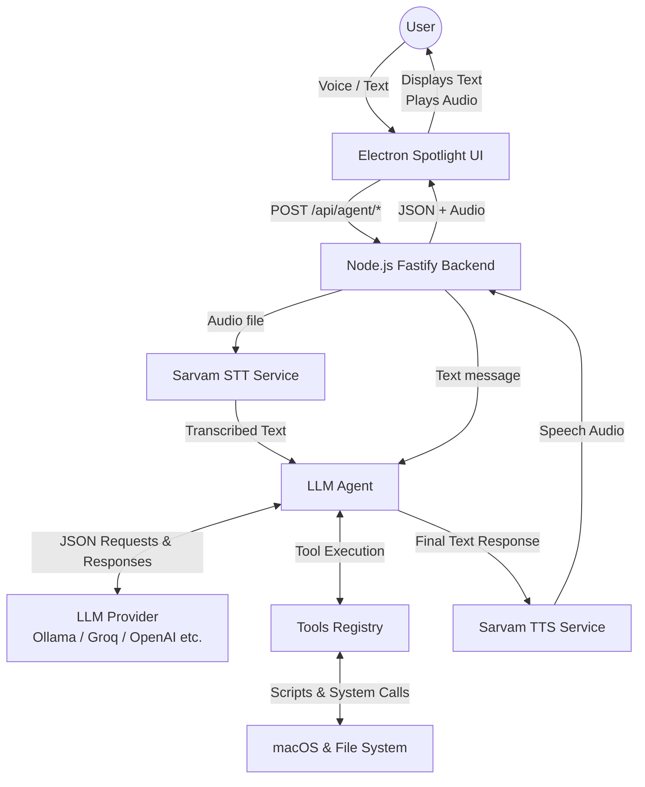

# Empth — Local AI OS Assistant (macOS)

Spotlight-like floating bar (Electron) + local backend (Fastify) + tool-based LLM agent + Sarvam STT/TTS.

## What you get

- Floating Spotlight-style bar (frameless, always-on-top) with text + mic
- Voice pipeline: mic → upload → Sarvam STT → agent
- Tool-based agent: model returns strict JSON `{ action, parameters }`
- Execution engine for file and OS tools: `read_file`, `write_text_file`, `create_folder`, `list_files`, `create_pdf`, `convert_file`
- Native OS automations via AppleScript: WhatsApp messaging, UI click/type, vision (llama-3.2-11b-vision-preview on Groq) to analyze current screen
- Response pipeline: final text → (optional) Sarvam TTS → auto-play audio
- Command history persisted in backend and exposed via API

## Architecture Diagram



## 1) Prereqs

- macOS
- Node.js 18+ (Node 20 recommended for built-in `FormData`/`Blob` stability)

## 2) Setup

```bash
cd /Users/eshan./Desktop/empth
cp .env.example .env
# fill in keys + endpoints
npm install
```

Minimum required to get text working:

- Option A (no key, local): `LLM_PROVIDER=ollama` (see below)
- Option B (cloud): `LLM_PROVIDER` + its API key
	- Groq (Meta/Llama models): `GROQ_API_KEY`
	- OpenAI: `OPENAI_API_KEY`
	- Anthropic: `ANTHROPIC_API_KEY`
	- Gemini: `GEMINI_API_KEY`

### Local LLM (recommended if you want “free”)

1) Install Ollama

```bash
brew install ollama
ollama serve
```

2) Pull a model

```bash
ollama pull llama3.1:8b
```

3) Set `.env`

```bash
LLM_PROVIDER=ollama
OLLAMA_BASE_URL=http://127.0.0.1:11434
OLLAMA_MODEL=llama3.1:8b
```

### Groq (cloud, usually easy to start)

Set `.env`:

```bash
LLM_PROVIDER=groq
GROQ_API_KEY=...
GROQ_MODEL=llama-3.1-8b-instant
```

To enable voice:

- `SARVAM_API_KEY`
- `SARVAM_STT_URL`

To enable spoken responses:

- `SARVAM_API_KEY`
- `SARVAM_TTS_URL`

## 3) Run (dev)

```bash
npm run dev
```

- Backend runs on `BACKEND_PORT` (default `3001`).
- Electron app launches after backend is reachable.

## 4) Keyboard shortcut

Default: `CommandOrControl+Space` (may conflict with Spotlight).
Change via `.env`:

```bash
ELECTRON_SHORTCUT=CommandOrControl+Shift+Space
```

## 5) Notes about Sarvam

Sarvam’s REST endpoints default to:

- `https://api.sarvam.ai/speech-to-text`
- `https://api.sarvam.ai/text-to-speech`

You can override via `SARVAM_STT_URL` / `SARVAM_TTS_URL`, but for most users you only need `SARVAM_API_KEY`.
All Sarvam calls happen from the backend only (API key never reaches the renderer).

## 6) Tools supported

The LLM agent can either respond normally or request a tool call using strict JSON. Available tools include:

### File Tools
- `read_file({ path })`: Read contents of a relative path.
- `write_text_file({ content, path })`: Write text to a path.
- `create_folder({ path })`: Create a directory.
- `list_files({ path })`: List contents of a directory.
- `create_pdf({ content, filename })`: Generate a PDF.
- `convert_file({ input_path, output_format })`: Convert files.

### OS & WhatsApp Tools (macOS Native)
- `open_application({ app_name })`: Opens a native Mac app (e.g., "WhatsApp", "VS Code").
- `read_active_window({})`: Dumps accessibility UI elements of the current window.
- `click_ui_element({ element_name })`: Clicks an exact button or label name in the active window.
- `type_text_os({ text, press_enter })`: Simulates physical keystrokes.
- `check_screen({ question })`: Takes a screenshot and queries a Vision model (like Groq LLaVA / Llama Edge Vision) from it.
- `save_whatsapp_contact({ contact_name, phone_number })`, `check_whatsapp_contact({ contact_name })`, `list_whatsapp_contacts({})`: Manipulates local store of WhatsApp contacts.
- `send_whatsapp_message({ contact_name, message })`: Actually sends the text via native automation.

Tool outputs are returned to the agent, which produces a final user-facing answer.

## 7) APIs

- `POST /api/agent/message` `{ "text": "..." }`
- `POST /api/agent/voice` multipart form-data `file=<audio/webm>`
- `GET /api/history`

## 8) Implementation map

- Electron window + shortcut: frontend/src/main.js
- Renderer UI + mic recording: frontend/renderer/renderer.js
- Backend server + routes: backend/src/server.js, backend/src/routes/agent.js
- Agent JSON/tool loop: backend/src/agent/agent.js
- Tools registry + implementations: tools/src/*
- LLM providers: services/src/llm/providers/*
- Sarvam STT/TTS wrappers: services/src/sarvam/*
